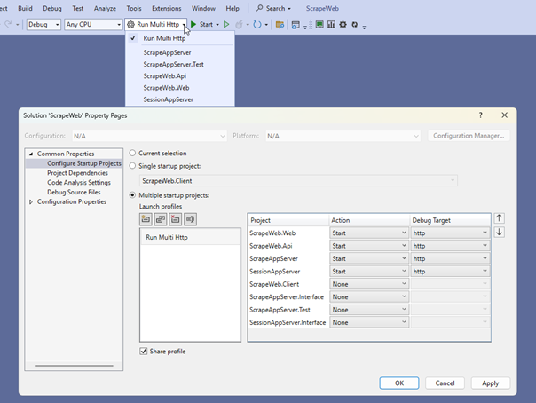
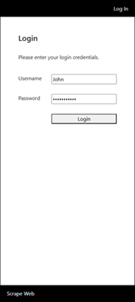
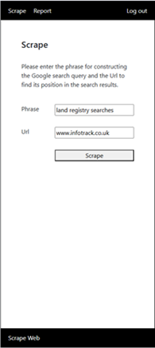
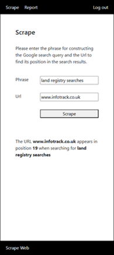
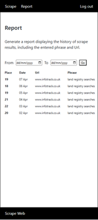

# Setup Instructions

## Clone the repository
 
Run the following command in your terminal:
```bash
git clone https://github.com/tartor/ScrapeWeb.git
```
 
## Open ScrapeWeb.sln in Visual Studio.
 
Build the solution.
- If you encounter npm errors during the build, delete the node_modules folder inside ScrapeWeb\ScrapeWeb.Client, then rebuild.
 
Launch the configuration named "Run Multi Http".
- If the login screen does not appear, it may be due to a CORS error. In that case, stop the solution. Ensure that the "http" Debug Target of the projects is selected and start it again. It can help to switch to a different Launch Profile and then reselect "Run Multi Http".
 
The "Run Multi Http" Configuration launches several projects together using the "http" Debug Target.



# Project Structure

## Frontend ([ScrapeWeb.Web](./ScrapeWeb.Web))
 
- ASP.NET Core web app responsible for hosting the Angular client.
- Can also be used to serve dynamic Angular configuration.

## Frontend ([ScrapeWeb.Client](./ScrapeWeb.Client) - Angular Application)
- Built the App UI using dependency injection, standalone components, routing, and signals for efficient data binding and state management.
- Implements client-side form validation and displays server-side errors for better UX and robustness.
- Utilizes route guards to prevent unauthorized users from accessing protected routes.
- API interfaces and models are auto-generated from Swagger using ng-openapi-gen, based on the OpenAPI spec exposed by ScrapeWeb.Api at:
http://localhost:5293/swagger/v1/swagger.json


## Backend (ScrapeWeb.Api)
 
- ASP.NET Core Web API serving as the backend for the Angular SPA.
- Exposes controllers for authentication, scraping , and reporting.
- References [SessionAppServer.Interface](./SessionMicroservice/SessionAppServer.Interface) and [ScrapeAppServer.Interface](./ScrapeMicroservice/ScrapeAppServer.Interface) to interact with backend microservices.
- Routes business logic to microservices: [SessionAppServer](./SessionMicroservice/SessionAppServer) and [ScrapeAppServer](./ScrapeMicroservice/ScrapeAppServer) via SOAP, using SoapCore.
- Handles session cookie management, including creation, validation, and deletion.
- Secures endpoints with a custom AuthenticatedAttribute to ensure only authorized clients can access them.
- Provides centralized error handling through GlobalExceptionMiddleware.
- Translates service-layer models into API-specific models to decouple internal logic from the frontend, allowing for independent evolution of each layer.
- Leverages dependency injection to enhance testability and maintainability.
  
## Microservice ([SessionAppServer](./SessionMicroservice/SessionAppServer))
 
- ASP.NET Core microservice that is accessed from [ScrapeWeb.Api](./ScrapeWeb.Api) via SoapCore.
- Shares the [SessionAppServer.Interface](./SessionMicroservice/SessionAppServer.Interface) to decouple the service from the client.
- Handles user login and session lifecycle (creation, validation, expiration).
- Simulates data persistence using [SessionDbContext](./SessionMicroservice/SessionAppServer/DB/SessionDbContext.cs) with an in-memory database.
- Leverages dependency injection to enhance testability and maintainability.

## Microservice ([ScrapeAppServer](./ScrapeMicroservice/ScrapeAppServer))
 
- ASP.NET Core microservice that also communicates with [ScrapeWeb.Api](./ScrapeWeb.Api) via SoapCore.
- Shares the [ScrapeAppServer.Interface](./ScrapeMicroservice/ScrapeAppServer.Interface) to keep the service and client loosely coupled.   
- Executes scraping tasks, stores results, and generates historical reports.
- Also uses [ScrapeDbContext](./ScrapeMicroservice/ScrapeAppServer/DB/ScrapeDbContext.cs) with an in-memory database.
- Leverages dependency injection to enhance testability and maintainability.

# App UI
- The app consists of three main screens: Login, Scrape, and Report.

    
  
- Scrape and Report are accessible only to authenticated users.
- The form fields are pre-populated for convenience, making it easier to test.
- Pre-populated values are provided for previous scrapes to facilitate testing of the reporting functionality.
- Two sample logins are available for testing:
   - User: John | Password: password123
   - User: Mark | Password: password123

  
# Scraping Google Search Results ([ScrapeAppServer](./ScrapeMicroservice/ScrapeAppServer))

I made several attempts to scrape Google search results directly from C# but ran into consistent roadblocks:
- Tried using HttpClient to call the search URL directly — no usable content was returned. ( [View HttpScraper.cs](./ScrapeMicroservice/ScrapeAppServer/Scrapers/HttpScraper.cs) )
- Simulated a browser by setting User-Agent and other headers in HttpClient — still no success. ( [View HttpBrowserScraper.cs](./ScrapeMicroservice/ScrapeAppServer/Scrapers/HttpBrowserScraper.cs) )
- Used Puppeteer as a headless browser, but Google continued to serve HTML that didn’t contain the expected result. ( [View PuppeteerScraper.cs](./ScrapeMicroservice/ScrapeAppServer/Scrapers/PuppeteerScraper.cs) )

Due to these limitations, I decided to manually save three versions of Google search result pages with InfoTrack appearing in different positions. ([View Resources](./ScrapeMicroservice/ScrapeAppServer/Resources/))

These files are now used as mock responses during scraping to simulate different outcomes.  ( [View Program.cs](./ScrapeMicroservice/ScrapeAppServer/Program.cs#L21-L27) ) ( [View FileScraper.cs](./ScrapeMicroservice/ScrapeAppServer/Scrapers/FileScraper.cs) )


## The scraping logic 
- Uses regular expressions ( [View GoogleScrapeProvider.cs](./ScrapeMicroservice/ScrapeAppServer/Providers/GoogleScrapeProvider.cs) )
- First, it identifies a pattern matching the searched URL.
- Then, it extracts the class name from the < a > tag where the URL was found.
- Finally, it searches the document for all elements with that same class name — under the assumption that all search results share this class.

This approach reduces reliance on hardcoded class names that might change over time, allowing the scraper to adapt as long as Google maintains a consistent structure within a result page.

